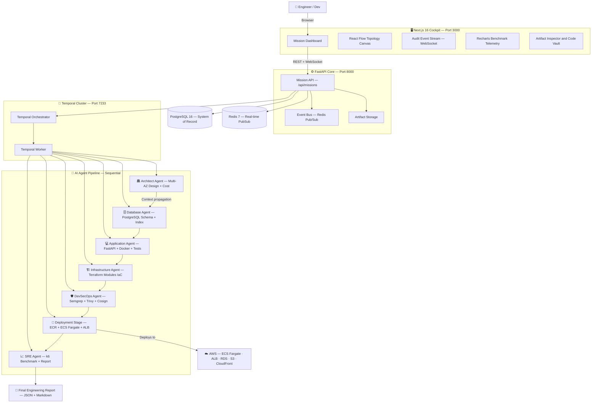

<div align="center">

# ⚡ AWS CloudSquad

### Autonomous Multi-Agent DevOps & Cloud Engineering Platform

*"From Requirement to Running Infrastructure — in a single command."*

[](https://nextjs.org)
[](https://fastapi.tiangolo.com)
[](https://temporal.io)
[](https://python.org)
[](https://docker.com)
[](https://aws.amazon.com)
[](LICENSE)
[](backend/tests)

</div>

---

## 📌 What Is This?

**AWS CloudSquad** is an autonomous DevOps control plane powered by **6 specialized AI agents** working sequentially through a closed-loop engineering lifecycle. Feed it a workload requirement, and it will autonomously:

1. Design a **Multi-AZ AWS Architecture** with cost breakdown
2. Generate a **PostgreSQL 16 schema** with indexing strategy
3. Scaffold a **containerized FastAPI** microservice
4. Synthesize **modular Terraform IaC** (VPC, ALB, ECS, RDS, IAM)
5. Run **DevSecOps security gates** (Semgrep, Trivy, Syft, Cosign)
6. Deploy to **AWS ECS Fargate** (or simulate with `dry-run` locally)
7. Execute a **k6 multi-stage load benchmark**
8. Generate a **structured SRE Final Report** (JSON + Markdown)

All through a real-time **Next.js 16 Cockpit Dashboard** with live WebSocket streaming, interactive React Flow topology canvas, and Recharts telemetry charts.

---

## 🏛️ System Architecture



---

## 🤖 The 6 Engineering Agents

| # | Agent | Role | Key Outputs |
|---|-------|------|-------------|
| 1 | **🏛️ ArchitectAgent** | Multi-AZ AWS architecture design, React Flow nodes/edges, monthly cost breakdown | `architecture.json`, topology diagram |
| 2 | **🗄️ DatabaseAgent** | Normalized PostgreSQL 16 schema, optimistic locking, compound index strategy | `schema.sql`, `migrations/` |
| 3 | **💻 ApplicationAgent** | FastAPI microservice with `/health` & `/ready`, non-root container (UID 10001) | `app.py`, `Dockerfile`, `tests/` |
| 4 | **🏗️ InfrastructureAgent** | Modular Terraform `vpc/alb/ecs/rds/iam` validated with `terraform fmt/validate` | `main.tf`, `modules/` |
| 5 | **🛡️ DevSecOpsAgent** | Semgrep SAST, Gitleaks, Trivy CVE scan, Syft SBOM, Cosign. **Hard gate: CRITICAL CVE = 0** | `security-report.json`, `sbom.json` |
| 6 | **📈 SREAgent** | Multi-stage k6 benchmark (baseline → load → stress → spike), SRE report | `sre-report.json`, telemetry data |

> **Deployment Stage**: Deterministic engineering activity — ECR image push + ECS service deployment. Not an AI agent.

---

## 🛠️ Tech Stack

### Frontend
| Technology | Version | Purpose |
|---|---|---|
| Next.js | 16.3.6 | React framework (App Router) |
| React | 19 | UI library |
| TypeScript | 5 | Type safety |
| Tailwind CSS | 4 | Utility-first styling |
| `@xyflow/react` | 12 | Interactive architecture topology canvas |
| Recharts | 3 | Benchmark telemetry charts |
| Zustand | 5 | Client state management |
| Lucide React | 1.48 | Icon system |
| JetBrains Mono | — | Monospace code font |
| Canvas Confetti | 1.9 | Mission completion celebration 🎉 |

### Backend
| Technology | Version | Purpose |
|---|---|---|
| Python | 3.11+ | Runtime |
| FastAPI | 0.115 | Async REST API framework |
| Pydantic | 2.9 | Request/response validation |
| SQLAlchemy | 2.0 | Async ORM |
| Asyncpg | 0.30 | PostgreSQL async driver |
| Temporalio SDK | 1.7 | Workflow orchestration client |
| Boto3 | 1.35 | AWS SDK |
| Structlog | 24.4 | Structured JSON logging |
| OpenAI / Anthropic | — | LLM gateway (optional) |

### Infrastructure & Toolchain
| Component | Technology |
|---|---|
| Workflow Engine | Temporal 1.24 (Docker self-hosted) |
| Database | PostgreSQL 16 |
| Cache & Event Bus | Redis 7 |
| Container Registry | Amazon ECR |
| Compute | AWS ECS Fargate |
| Load Balancer | Application Load Balancer (ALB) |
| Security Scanning | Semgrep, Trivy, Gitleaks, Syft, Cosign |
| Infrastructure as Code | Terraform (modular) + Checkov |
| Performance Testing | k6 |

---

## 📦 Project Structure

```
aws-cloudsquad/
├── backend/                       # FastAPI application
│   ├── agents/                    # 6 AI agent implementations
│   │   ├── architect.py           # ArchitectAgent
│   │   ├── database.py            # DatabaseAgent
│   │   ├── application.py         # ApplicationAgent
│   │   ├── infrastructure.py      # InfrastructureAgent
│   │   ├── devsecops.py           # DevSecOpsAgent
│   │   └── sre.py                 # SREAgent
│   ├── api/                       # REST API routers
│   │   ├── missions.py            # /api/missions
│   │   ├── events.py              # /api/events
│   │   ├── artifacts.py           # /api/artifacts
│   │   └── ws.py                  # WebSocket /ws/mission/{id}
│   ├── workflows/                 # Temporal workflow definitions
│   │   ├── mission_workflow.py    # MissionWorkflow (@workflow.defn)
│   │   └── activities.py          # 8 stage activity functions
│   ├── workers/                   # Temporal worker process
│   ├── services/                  # LLM gateway, event bus
│   ├── models/                    # SQLAlchemy ORM models
│   ├── schemas/                   # Pydantic schemas
│   ├── database/                  # DB session & migrations
│   ├── tests/                     # 11 automated tests
│   ├── config.py                  # Pydantic Settings
│   ├── main.py                    # FastAPI entry point
│   └── requirements.txt
│
├── frontend/                      # Next.js 16 cockpit
│   ├── app/
│   │   ├── layout.tsx             # Root layout + fonts
│   │   ├── page.tsx               # Main cockpit dashboard
│   │   └── globals.css            # Design system CSS
│   ├── components/
│   │   ├── Header.tsx             # Navigation + mission status
│   │   ├── EngineerStation.tsx    # 6-agent card grid
│   │   ├── ArchitectureCanvas.tsx # React Flow topology
│   │   ├── EventTimeline.tsx      # Live audit event stream
│   │   ├── TelemetryBar.tsx       # Benchmark telemetry charts
│   │   ├── ArtifactModal.tsx      # Code vault inspector
│   │   ├── CreateMissionModal.tsx # New mission form
│   │   └── FinalReportModal.tsx   # SRE report viewer
│   └── lib/
│       ├── api.ts                 # REST API client
│       └── websocket.ts           # WebSocket client
│
├── docs/                          # Extended documentation
├── missions/                      # Mission config templates
├── security/                      # Security policy definitions
├── docker-compose.yml             # Full-stack environment
├── .env.example                   # Environment variable template
├── TUTORIAL.md                    # Step-by-step beginner guide
└── README.md
```

---

## 🚀 Quick Start

### Prerequisites

| Requirement | Min Version | Check |
|---|---|---|
| Docker Desktop | 24.0+ | `docker --version` |
| Docker Compose | 2.20+ | `docker compose version` |
| Git | 2.40+ | `git --version` |
| Node.js *(optional, for local dev)* | 20+ | `node --version` |
| Python *(optional, for local dev)* | 3.11+ | `python --version` |

### 1 — Clone & Configure

```bash
git clone https://github.com/anggapbwr/AWS-CloudSquad.git
cd aws-cloudsquad

# Copy the environment template
cp .env.example .env
```

The defaults in `.env.example` work out-of-the-box for local demo (`DEMO_MODE=true`).

### 2 — Launch Full Stack

```bash
docker compose up --build
```

| Service | Port | Description |
|---|---|---|
| `frontend` | **3000** | Next.js Cockpit Dashboard |
| `backend` | **8000** | FastAPI Core API + Swagger UI |
| `temporal-ui` | **8088** | Temporal Workflow Web UI |
| `temporal` | 7233 | Temporal gRPC (internal) |
| `postgres` | 5432 | PostgreSQL 16 |
| `redis` | 6379 | Redis 7 |

### 3 — Open the Cockpit

**[http://localhost:3000](http://localhost:3000)**

### 4 — Create & Launch a Mission

1. Click **"New Mission"** → configure requirements → **"Initialize Mission"**
2. Click **"Launch Mission"** → watch 6 agents execute live

---

## ⚙️ Environment Configuration

Key variables in `.env`:

```env
# Execution Mode (most important!)
DEPLOYMENT_MODE=dry-run   # dry-run | apply
DEMO_MODE=true            # true = no real AWS calls

# AI Provider (pick one)
LLM_PROVIDER=deterministic  # deterministic | openai | anthropic | bedrock
MODEL_ID=claude-3-5-sonnet-20241022
OPENAI_API_KEY=             # if LLM_PROVIDER=openai
ANTHROPIC_API_KEY=          # if LLM_PROVIDER=anthropic

# AWS (only needed for DEPLOYMENT_MODE=apply)
AWS_REGION=ap-southeast-1
AWS_ACCESS_KEY_ID=
AWS_SECRET_ACCESS_KEY=
```

> **`DEMO_MODE=true`** — default for local dev. Simulates all AWS API calls; no credentials needed.  
> **`DEPLOYMENT_MODE=apply`** — provisions real AWS infrastructure. Requires IAM permissions for ECS, ECR, RDS, S3.

---

## 🔌 API Reference

Full OpenAPI docs at **[http://localhost:8000/docs](http://localhost:8000/docs)**

```
# Platform
GET  /                              Platform info & status
GET  /health                        Health check

# Missions
POST /api/missions                  Create a new mission
GET  /api/missions                  List all missions
GET  /api/missions/{id}             Get mission details + stage status
POST /api/missions/{id}/run         Trigger the mission pipeline

# Data
GET  /api/events/{mission_id}       Mission audit event log
GET  /api/artifacts/{mission_id}    Generated artifact files
GET  /api/artifacts/{mission_id}/report   Final SRE report

# Real-time
WS   /ws/mission/{id}               WebSocket live event stream
```

---

## 📊 Pipeline Flow

```
MISSION CREATED
      │
      ▼
┌─────────────────────────────────────────────────────────┐
│              TEMPORAL DURABLE WORKFLOW                   │
│  ┌──────────────────────────────────────────────────┐   │
│  │  1. ARCHITECT      → architecture + diagram      │   │
│  │  2. DATABASE       → schema + migrations         │   │
│  │  3. APPLICATION    → FastAPI app + Dockerfile    │   │
│  │  4. INFRASTRUCTURE → Terraform modules           │   │
│  │  5. DEVSECOPS  ⚠️ → security gates (CRITICAL=0) │   │
│  │  6. DEPLOYMENT     → ECR push + ECS deploy       │   │
│  │  7. SRE            → k6 benchmark + telemetry    │   │
│  │  8. FINAL REPORT   → JSON + Markdown export      │   │
│  └──────────────────────────────────────────────────┘   │
│     Each stage: 5 min timeout · 3 retries · exp backoff  │
└─────────────────────────────────────────────────────────┘
      │
      ▼
MISSION COMPLETED 🎉
```

---

## 🔐 Security Model

| Gate | Tool | Policy |
|---|---|---|
| Static Analysis | Semgrep | Zero high-severity findings |
| Secret Detection | Gitleaks | Zero committed secrets |
| Container CVE | Trivy | **CRITICAL = 0 (hard block)** |
| SBOM | Syft | Full bill of materials |
| Image Signing | Cosign | Signature verification |
| IaC Compliance | Checkov | Terraform policy checks |

---

## 🧪 Testing

```bash
# Backend tests (run from project root)
cd backend
python -m pytest tests/ -v

# Expected output: 11/11 passed
```

---

## 🗺️ Roadmap

- [x] 6-Agent closed-loop engineering pipeline
- [x] Temporal durable workflow orchestration
- [x] PostgreSQL 16 + Redis real-time event streaming
- [x] Next.js 16 cockpit with React Flow topology canvas
- [x] Recharts performance telemetry dashboard
- [x] Multi-format artifact code inspector
- [x] DevSecOps hard-blocking security gates
- [x] k6 multi-stage benchmark suite
- [x] SRE final report (JSON + Markdown export)
- [x] Glassmorphism UI redesign (Sept 2026)
- [ ] Multi-region Active-Active DR mission templates
- [ ] Argo Rollouts automated canary rollback
- [ ] IAM least-privilege generation from CloudTrail
- [ ] Slack/Teams stage completion notifications
- [ ] Mission cost comparison & optimization recommendations

---

## 📚 Documentation

| Document | Description |
|---|---|
| [TUTORIAL.md](TUTORIAL.md) | Step-by-step guide: zero to first mission |
| [Architecture & Design](docs/architecture.md) | System design philosophy & tenets |
| [The 6 Agents](docs/agents.md) | Agent capabilities deep-dive |
| [Temporal Workflow](docs/workflow.md) | Orchestration & retry policies |
| [AWS Deployment](docs/aws-deployment.md) | Deploying to real AWS |
| [DevSecOps Gates](docs/security.md) | Security scanning policies |
| [Performance & SRE](docs/performance-testing.md) | k6 methodology |

---

## 🤝 Contributing

1. Fork the repository
2. Create a feature branch: `git checkout -b feature/my-feature`
3. Run tests: `python -m pytest backend/tests -v`
4. Commit with conventional commits: `git commit -m "feat: add my feature"`
5. Push & open a Pull Request

---

## 📄 License

MIT License — see [LICENSE](LICENSE) for details.

---

<div align="center">

**Built with ❤️ — Next.js 16 · FastAPI · Temporal · AWS**

*AWS CloudSquad v2.0 · Autonomous DevOps & Cloud Engineering Platform*

</div>
